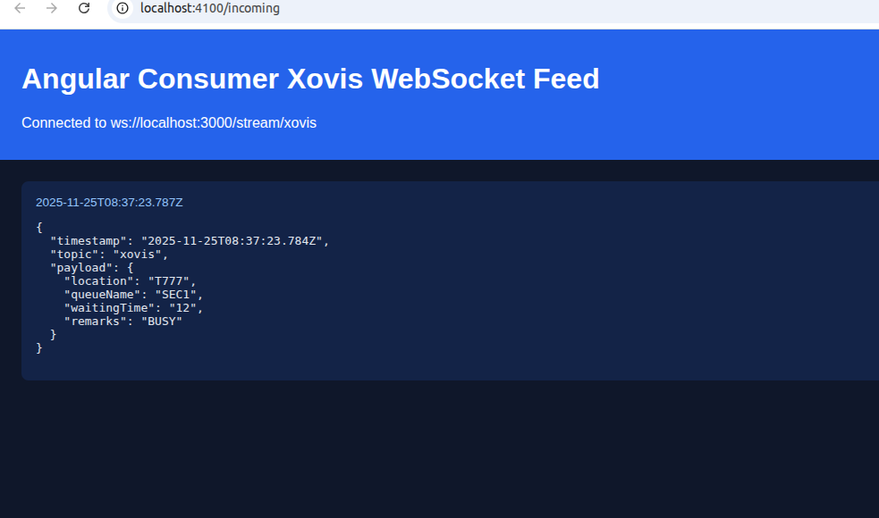
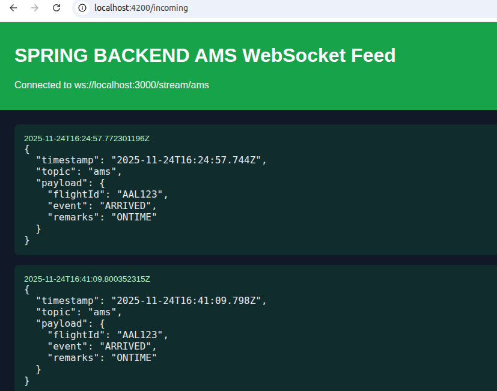

# Aero Stream Event Hub

## Overview

Universal Architecture with schema/filteration support and full  integration support with existing systems(Angular/Spring bundled clients for use but all supported)

Aero Stream is a lightweight HTTP + WebSocket event fan-out designed for airport operations. Think of it as a simpler alternative to Kafka or Azure Event Hub for ingesting feeds from AMS, Xovis, and other Aero sensor systems. Producers post events to topic-specific HTTP endpoints, and every consumer subscribed to that topic instantly receives those events over WebSockets.

```
		   +------------------+
Producer   |    Express        |
 POST /publish/:topic          |
		   +---------+---------+
					 |
			  Message routed by topic
					 |
		   +---------v---------+       Broadcast via WS
		   | WebSocket Hub     |=================================
		   | ws://.../stream/:topic
		   +---------+---------+       Real-time consumers
					 |
	   +-------------+-------------+
	   |             |             |
	 +-v--+        +-v--+        +-v--+
	 |C1  |        |C2  |        |C3  |
	 |WS  |        |WS  |        |WS  |
	 +----+        +----+        +----+
```

## Core Components

- Topic-specific JSON schemas under `schemas/` validate inbound payloads before broadcasting. `ams` requires `flightId`, `event`, and `remarks`; `xovis` requires `location`, `queueName`, `waitingTime`, and optional `remarks`.

## Local Dev Quickstart

1. Install Node.js 18+ (includes `npm`).
2. `npm install` to pull dependencies.
3. `npm run dev` starts Express with WebSocket support.
4. Publish an AMS event: `curl -X POST http://localhost:3000/publish/ams -H "Content-Type: application/json" -d '{"flightId":"AAL123","event":"ARRIVED","remarks":"ONTIME"}'`.
5. Publish a Xovis event: `curl -X POST http://localhost:3000/publish/xovis -H "Content-Type: application/json" -d '{"location":"T1","queueName":"SEC1","waitingTime":"12","remarks":"BUSY"}'`.
6. Connect a WebSocket client (e.g., browser console, `wscat`) to `ws://localhost:3000/stream/ams` or `ws://localhost:3000/stream/xovis` and watch topic-scoped events arrive.
7. Visit `http://localhost:3000/admin` to browse the latest entries captured in `inbound.log`.

## Load Testing

- `node --test tests/loadtest.test.js` hammers `/publish/loadtest` with bursts from 100 to 1000 requests per second.
- The stream reliably sustained 900 TPS while continuing to fan out WebSocket traffic to connected clients.
- Summary messages are stored as `loadtest` entries in `inbound.log`, capturing transactions per second, success/fail counts, and average response time.
- 

## Clients of Aero Stream

### Angular Dashboard (Xovis)

- Folder: `clients/node-consumer`
- Connects over `ws://localhost:3000/stream/xovis`, caches the latest 200 payloads, and serves a live dashboard at `http://localhost:4100/incoming`.
- Run with `npm install && npm start` from within the client directory.
- 

### Spring Backend (AMS)

- Folder: `clients/spring-consumer`
- Uses Java-WebSocket to subscribe to `ws://localhost:3000/stream/ams` and exposes both HTML and JSON endpoints at `http://localhost:4200/incoming` and `/events`.
- Start via `mvn spring-boot:run` inside the consumer module; received AMS events appear instantly in the dashboard.
- 
## Next Steps

- Wrap published events in a consistent schema (timestamp, source, payload).
- Add wildcard subscriptions so some clients can mirror multiple topics when needed.
- Add minimal auth (API key header for producers, token gate for consumers).
- Implement optional retry/backoff logic for transient publish failures.
- Persist inbound logs to long-term storage once durability requirements grow.

## Contributing

- Use feature branches for enhancements or bug fixes.
- Add lightweight tests (integration or smoke) whenever behavior changes.
- Submit pull requests with clear context, especially around event formats.

## License

GPL

## Tests 
Tests use the local server.js server running on home port and don't spin up new.